  

> **CLASSIFIED OPERATION:** SECURITY OPERATIONS, LOG INGESTION & THREAT CORRELATION  
> **STATUS:** CONCLUDED | **AUTHOR:** MR. CIPHER-X [C|THE]

 

### 🛡️ Operation Abstract

This repository details the architecture and execution of a centralized Security Operations Center (SOC) log analysis pipeline. The objective was to ingest diverse telemetry sources (Endpoints, Firewalls, Web Servers), parse the raw data, and write custom SIEM correlation rules to detect persistent threats, brute-force attempts, and lateral movement in real-time.

---

### ⚙️ SIEM Architecture & Data Pipeline

```mermaid
graph TD;
    A[Windows Event Logs] --> D(Log Forwarder / Beats);
    B[Linux Syslog & auth.log] --> D;
    C[Firewall / IDS Traffic] --> D;
    D -->|Encrypted JSON Stream| E{SIEM Core Engine};
    E -->|Grok Parsing & Normalization| F[Indexed Storage];
    E -->|Custom Correlation Rules| G[Threat Detection Logic];
    G -->|Threshold Exceeded| H[SOC Analyst Dashboard];
    H -->|Triage & Mitigation| I[Incident Response];
    
    style E fill:#1a1a1a,stroke:#00FFFF,stroke-width:2px;
    style H fill:#1a1a1a,stroke:#8A2BE2,stroke-width:2px;
```

---

### 🦠 Threat Detection Matrix (Correlation Rules)

| **Threat Vector** | **Log Source / Event ID** | **Detection Logic (SIEM Query Base)** | **Tactical Response** |
| :--- | :--- | :--- | :--- |
| **Active Directory Brute Force** | Windows Security Logs (Event ID: `4625`) | Count > 10 failed logins within 5 mins from a single IP. | Automate IP block at perimeter firewall. |
| **Privilege Escalation** | Linux `auth.log` / `secure` | Unauthorized user executing `sudo su` or adding to `wheel` group. | Trigger high-severity alert, isolate endpoint. |
| **Web Application Attack (SQLi)** | Apache / Nginx Access Logs | HTTP GET/POST containing anomalous characters (`' OR 1=1--`). | Blacklist source IP, review WAF configurations. |

---

### 📸 Digital Evidence Board

*(Note: Real-world client telemetry is redacted. The following evidence represents SIEM dashboards and query executions.)*

  <!-- NOTE: REPLACE THESE SRC LINKS WITH YOUR ACTUAL GITHUB IMAGE PATHS -->
  
  &nbsp; &nbsp;
  

---

  <code>[ OPERATION TERMINATED - TELEMETRY SECURED ]</code>

